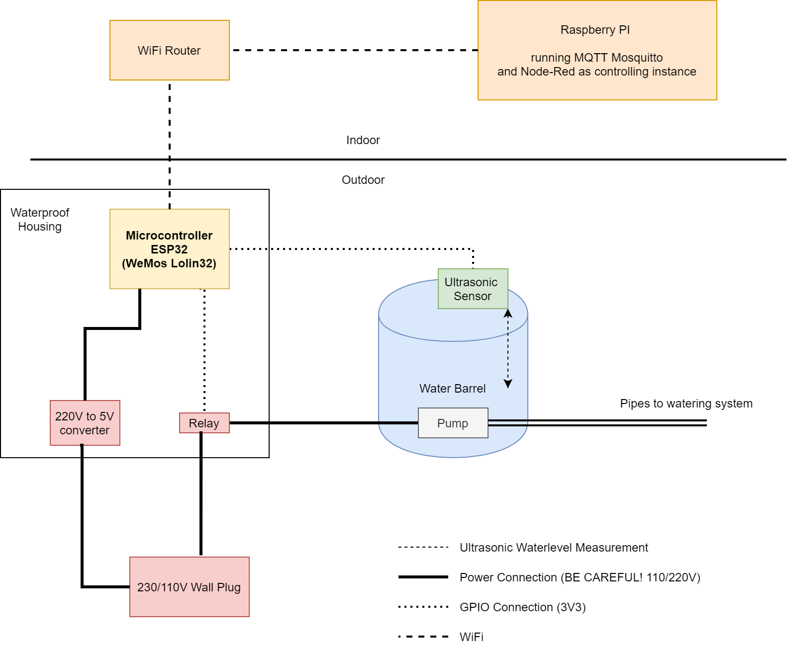

= ESP32 Controlled Gardener

== Installation

* Install latest Arduino IDE
* Install ESP https://github.com/espressif/arduino-esp32/blob/master/docs/arduino-ide/boards_manager.md[library] for Arduino
* Select the correct board in IDE
* Copy config.h.example to config.h and modify the neccessary values
* Upload and start!

== Overview

